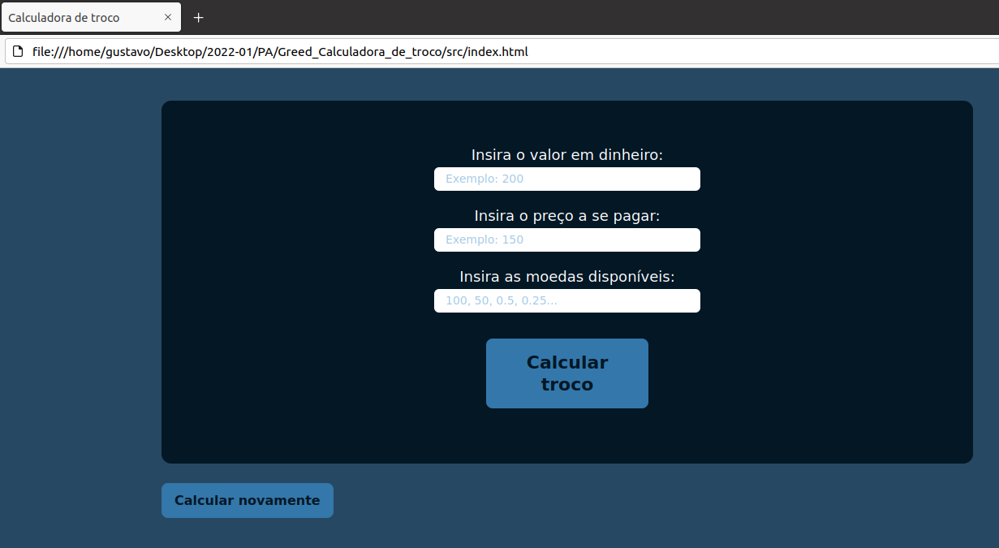
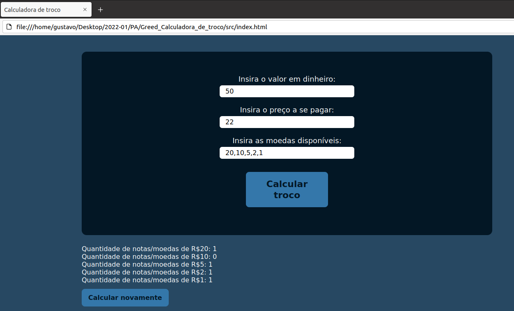
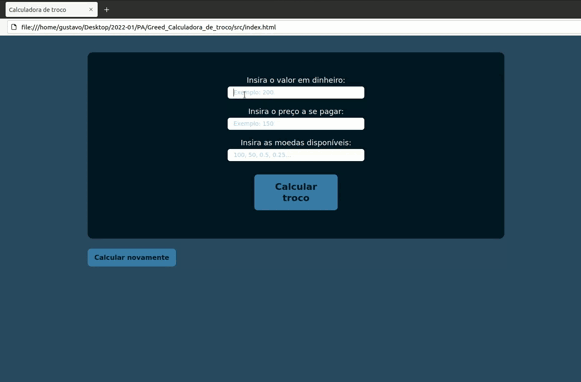
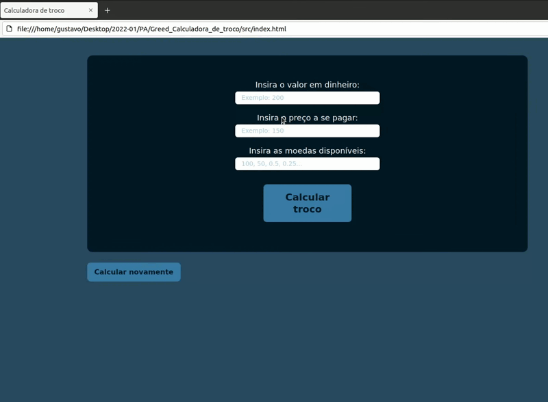

# NomedoProjeto

**Conteúdo da Disciplina**: Greed<br>

## Alunos
|Matrícula | Aluno |
| -- | -- |
| 19/0027088 |  Eliás Yousef Santana Ali |
| 20/0038141  | Gustavo Duarte Moreira |

## Sobre 
O projeto consiste em uma calculadora de troco, em que o usuário da calculadora insere o valor recebido do cliente, o valor gasto pelo cliente e quais são os valores das notas disponíveis no seu caixa. O sistema calcula a quantidade mínima de notas para devolver o troco para o cliente.


## Screenshots













## Instalação 
**Linguagem**: javascript<br>
**Framework**: N/A<br>

***Pre-requsitos***

Possuir um navegador de internet instalado na máquina.

## Uso 
**Clonar o repositório**
```
    git clone https://github.com/projeto-de-algoritmos/Greed_Calculadora_de_troco.git
```
**Entar o repositório**
```
    cd Greed_Calculadora_de_troco/src
```
**Executar o comando**
```
    Abrir o arquivo index.html em um navegador
```
## Outros 
Observação: Os testes foram realizados em dois computadores um no sitema operacional UBUNTU 20.04 e outro no Windows 10.


## Video

[Video da apresentação](video/Greed_Calculadora_de_troco)


